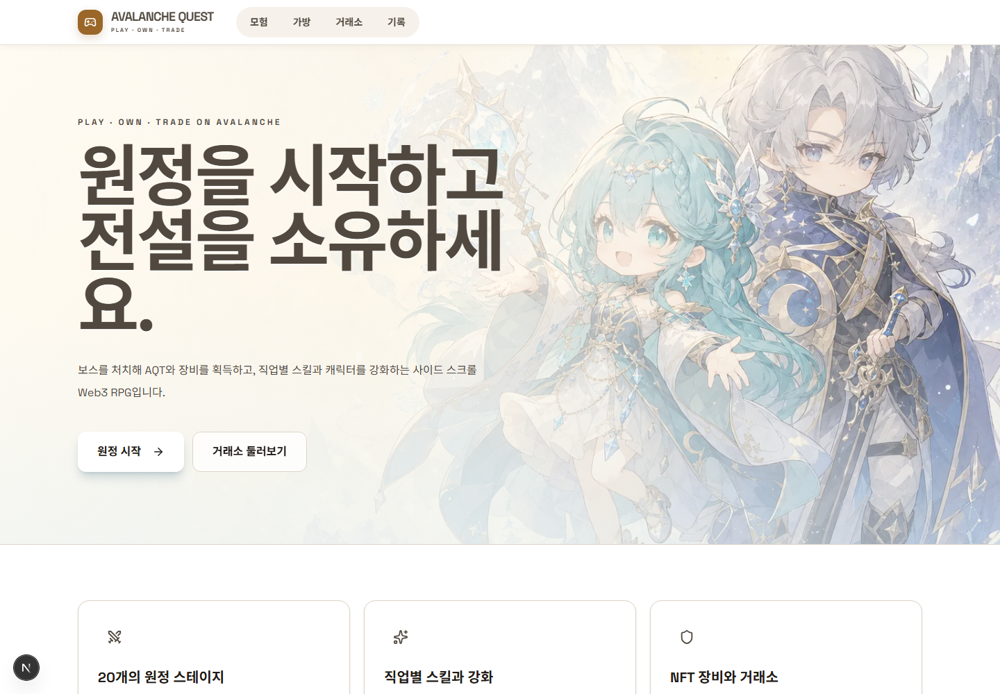
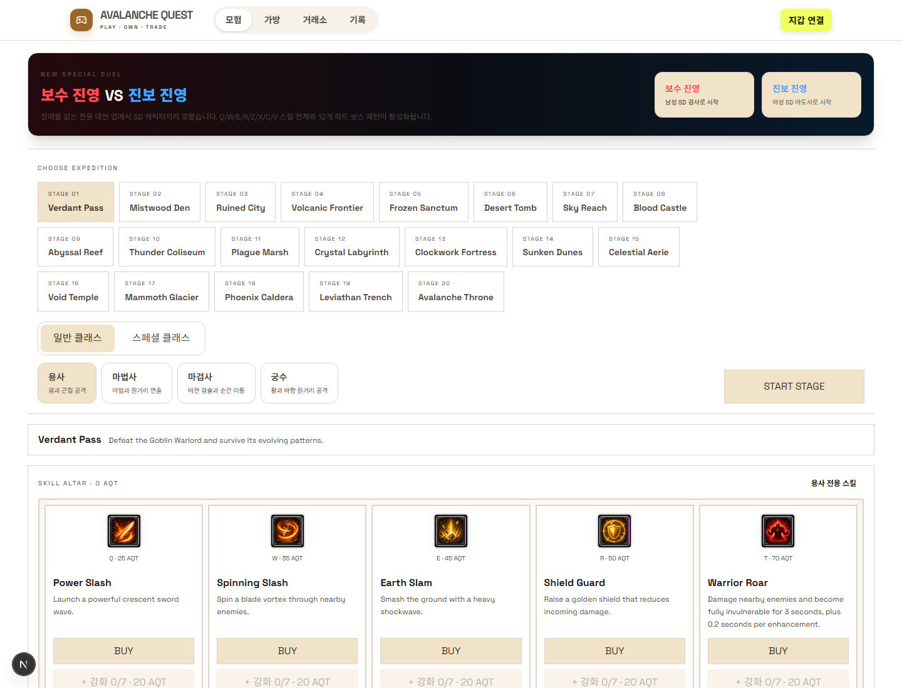
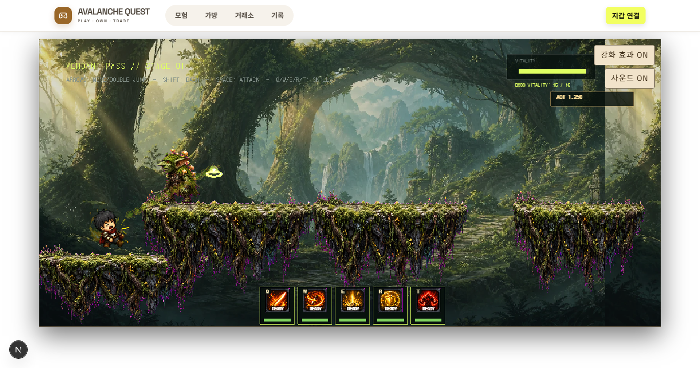

# Avalanche Quest

Avalanche Fuji Testnet에서 동작하는 사이드 스크롤 Web3 액션 RPG입니다. 지갑을 연결해 20개 스테이지와 보스를 공략하고, 서버 검증을 통과한 플레이 결과로 AQT ERC-20 보상과 ERC-721 장비를 획득합니다. 획득한 장비는 인벤토리에서 확인하고 온체인 마켓플레이스에 등록하거나 구매할 수 있습니다.

> 네트워크: Avalanche Fuji C-Chain (`43113`)<br>
> 프로젝트 상태: 포트폴리오 / 테스트넷 MVP<br>
> 배포 주소: [https://avalanche-quest.vercel.app](https://avalanche-quest.vercel.app)

## MetaMask에 AQT 토큰 추가

먼저 지갑 네트워크를 **Avalanche Fuji Testnet**으로 변경한 다음, MetaMask의 `토큰 가져오기`에서 아래 정보를 입력합니다.

| 항목 | 값 |
| --- | --- |
| 네트워크 | Avalanche Fuji Testnet |
| Chain ID | `43113` |
| 토큰 컨트랙트 주소 | `0xD182A7E85E201412D9f69D98Be3127eC126F05f9` |
| 토큰 기호 | `AQT` |
| 소수점 | `18` |

컨트랙트는 [Snowtrace에서 확인](https://testnet.snowtrace.io/address/0xD182A7E85E201412D9f69D98Be3127eC126F05f9)할 수 있습니다. 이 AQT는 Fuji 테스트넷용 게임 토큰이므로 Avalanche Mainnet에서는 잔액이 표시되지 않습니다.

## 프로젝트 화면

### 메인 화면



### 스테이지·클래스·스킬 선택



### 실제 인게임 전투



## 주요 기능

- RainbowKit 기반 지갑 연결 및 Avalanche Fuji 네트워크 연동
- Phaser 3로 구현한 20개 사이드 스크롤 스테이지
- 일반 클래스 8종과 특수 진영 클래스 2종
- 쌍검사·권격가·용기사·총잡이 전용 SD 동작 8종과 클래스별 5개 고유 스킬
- 몬스터, 보스, 투사체, 충돌, 피격, 대시, 이단 점프 전투
- 키보드와 모바일 터치 입력이 같은 전투 로직을 공유
- 서버 발급 시도 ID와 플레이 텔레메트리를 이용한 스테이지 결과 검증
- EIP-712 서명 기반 ERC-20 보상 및 ERC-721 장비 민팅
- AQT를 사용하는 스킬 구매, 스킬 강화, 갑옷 강화, 캐릭터 강화
- NFT 인벤토리와 에스크로 방식 고정가 마켓플레이스
- 모바일·태블릿 반응형 UI, 가로 회전 안내 및 게임 전체화면
- 모든 블록체인 쓰기 작업에 pending, success, error 상태 제공

## 기술 스택

| 영역 | 기술 | 적용 방식 |
| --- | --- | --- |
| Framework | Next.js 16 App Router | 페이지 라우팅, Server Components, `/api/attempts`와 `/api/rewards` Route Handlers |
| UI | React 19, Tailwind CSS 4 | 지갑·트랜잭션 상태 UI, 반응형 데스크톱·태블릿·모바일 레이아웃 |
| Language | TypeScript 5 strict mode | 게임 이벤트, 컨트랙트 데이터, API 응답 경계의 정적 타입 검증 |
| Game Engine | Phaser 3.90 | Arcade Physics, Scene 생명주기, 충돌, 카메라, 입력, 애니메이션과 오디오 |
| Wallet | RainbowKit, wagmi 2 | 지갑 연결, Fuji 네트워크 상태, 컨트랙트 write lifecycle |
| EVM Client | viem 2 | 타입 기반 컨트랙트 read/write, 트랜잭션 영수증, EIP-712 서명과 주소 검증 |
| Smart Contracts | Solidity 0.8.28 | ERC-20 보상, ERC-721 장비, 스킬·강화 경제, NFT 마켓플레이스 |
| Contract Library | OpenZeppelin 5 | ERC 표준, AccessControl, EIP712, ECDSA, SafeERC20, ReentrancyGuard |
| Contract Tooling | Hardhat 3, Hardhat Ignition | Solidity 컴파일, 테스트, Fuji 배포와 컨트랙트 의존성 연결 |
| Blockchain | Avalanche Fuji C-Chain | Chain ID `43113` 테스트넷에서 게임 자산과 거래 상태 관리 |
| Database | Supabase | Vercel용 영구 attempt/claim 저장소로 연결 예정; public/service key 환경 구성 완료 |
| Hosting / CI | Vercel, GitHub | Next.js 배포, Preview/Production 빌드, Git 기반 자동 배포 |

### 기술 선택 이유

- **Next.js와 Phaser 분리:** 웹 애플리케이션의 라우팅·지갑·서버 검증과 실시간 게임 루프를 서로 다른 생명주기로 관리합니다.
- **wagmi + viem:** React 트랜잭션 상태 관리와 낮은 수준의 타입 안전 EVM 호출을 함께 사용합니다.
- **EIP-712:** 서버가 승인한 보상 데이터에만 서명하고, 컨트랙트가 체인·주소·nonce·deadline을 검증합니다.
- **Hardhat Ignition:** 10개 컨트랙트의 배포 순서, 생성자 의존성, 역할 부여와 초기 스킬 가격을 재현 가능한 모듈로 관리합니다.
- **Vercel + Supabase:** 프론트엔드와 API Route는 Vercel에 배포하고 서버리스 인스턴스 간 상태는 Supabase로 영구화하는 구조를 목표로 합니다.

## 시스템 구조

```text
플레이어 지갑
    │
    ▼
Next.js / React UI ───── wagmi + viem ───── Avalanche Fuji
    │                                          │
    │                                          ├─ ERC-20 AQT
    │                                          ├─ ERC-721 GameItem
    │                                          ├─ RewardDistributor
    │                                          ├─ 스킬·강화 컨트랙트
    │                                          └─ ItemMarketplace
    │
    ├─ Phaser QuestScene
    │    ├─ 이동·충돌·전투
    │    ├─ 몬스터·보스·스킬
    │    └─ 제한된 플레이 이벤트
    │
    └─ Next.js Route Handlers
         ├─ POST /api/attempts
         ├─ 플레이 결과 검증
         └─ EIP-712 보상·아이템 서명
```

게임 시뮬레이션과 블록체인 처리를 분리했습니다. `src/game`은 지갑, 컨트랙트 주소, 보상 수량을 알지 못하고 플레이 이벤트만 React 경계로 전달합니다. React와 서버가 검증 및 트랜잭션 생명주기를 담당합니다.

## 주요 구현 방식

### 1. 게임 실행 구조

`GameCanvas`가 클라이언트에서만 Phaser를 동적 로딩하고 `QuestScene`을 생성합니다. Phaser Scene은 이동, 물리 충돌, 체력, 스킬 쿨다운, 몬스터 AI, 보스 패턴과 스테이지 완료 여부를 담당합니다.

스테이지 결과는 직렬화 가능한 `StageResult`로 React에 전달됩니다. Phaser 객체나 지갑 객체가 경계를 넘어가지 않도록 하여 게임 코드와 애플리케이션 코드를 분리했습니다.

### 2. 데스크톱·모바일 조작

키보드 입력과 터치 입력은 별도의 전투 구현을 사용하지 않습니다. 모바일 버튼은 `setMobileAction`과 `triggerMobileSkill`을 호출하며, Scene의 기존 공격·이동·스킬 큐와 쿨다운 로직으로 합쳐집니다. 따라서 PC와 모바일의 데미지 및 판정 규칙이 같습니다.

모바일에서는 화면 크기와 방향 변경 시 Phaser Scale Manager를 갱신하고, 전체화면 진입 시 브라우저가 지원하면 landscape orientation lock을 요청합니다.

쌍검사, 권격가, 용기사, 총잡이는 대기, 걷기, 달리기, 점프·대시, 기본 공격, 스킬 시전, 피격, 사망 동작을 각각 애니메이션으로 재생합니다. 네 클래스 모두 Q/W/E/R/T 5개 스킬을 AQT로 구매하고 강화할 수 있으며 R만 버프 스킬입니다. 쌍검사는 적의 뒤로 순간 이동하는 `Shadow Reversal`, 권격가는 회전하지 않는 거대한 주먹 투사체 `Titan Fist`, 용기사는 화염 창술과 용의 충격파, 총잡이는 관통탄·산탄·도탄·탄막을 사용합니다.

### 3. 플레이 결과와 보상 검증

1. 지갑 주소와 스테이지를 서버에 보내 attempt ID를 발급받습니다.
2. 클라이언트는 플레이 중 제한된 텔레메트리 이벤트를 기록합니다.
3. 서버는 이벤트 순서, 실행 시간, 스테이지 ID, 필수 보스 처치와 중복 제출 여부를 검사합니다.
4. 보상 수량은 클라이언트가 아닌 서버의 스테이지 테이블에서 계산합니다.
5. 검증 성공 시 서버 전용 reward signer가 EIP-712 claim을 서명합니다.
6. 플레이어가 서명된 claim을 Fuji 컨트랙트에 제출합니다.

`RewardDistributor`는 claim ID, attempt ID, 플레이어 nonce, deadline, chain ID와 verifying contract를 검사하여 재사용과 다른 체인에서의 재생 공격을 방지합니다.

### 4. NFT 장비 발행 흐름

보스 장비가 선택되면 서버는 아이템 타입, 희귀도, 전투력, 메타데이터 해시가 포함된 별도의 EIP-712 `MintClaim`을 만듭니다. `GameItem`은 서명자, 플레이어, nonce, deadline, claim ID, attempt ID와 메타데이터 해시를 검증한 후 ERC-721을 발행합니다.

### 5. 스킬·강화 경제 시스템

- `SkillShop`: AQT 결제 후 지갑별 스킬 소유 상태 기록
- `SkillEnhancement`: 구매한 스킬만 최대 7단계까지 강화
- `ArmorEnhancement`: Aegis Armor 소유자만 최대 5단계 강화
- `CharacterUpgradeV3`: 공격력, 생명력, 방어력을 최대 20단계 강화

캐릭터 강화 V3는 V2의 레벨을 읽는 legacy adapter를 사용합니다. 기존 배포의 강화 기록을 버리지 않고 새로운 가격 곡선과 최대 레벨 정책으로 이전하도록 구성했습니다.

### 6. NFT 마켓플레이스

판매자는 NFT를 `ItemMarketplace`에 에스크로하고 AQT 가격을 설정합니다. 구매 시 `SafeERC20`으로 구매자의 AQT를 판매자에게 전송한 다음 NFT를 구매자에게 전달합니다. 상태를 먼저 비활성화하고 `ReentrancyGuard`를 적용해 재진입 위험을 줄였습니다.

## Fuji 컨트랙트 배포 주소

아래 주소는 Hardhat Ignition의 `fuji-rewards` 배포 기록을 기준으로 합니다.

| 컨트랙트 | 주소 | 역할 |
| --- | --- | --- |
| GameToken | [`0xD182...05f9`](https://testnet.snowtrace.io/address/0xD182A7E85E201412D9f69D98Be3127eC126F05f9) | 최대 공급량이 제한된 ERC-20 AQT, MINTER_ROLE 기반 발행 |
| RewardDistributor | [`0x21F7...2f8b`](https://testnet.snowtrace.io/address/0x21F797e0c02F2bbec8a640Cf291298fe89ec2f8b) | 서버 EIP-712 서명 검증, nonce·claim·attempt 재사용 방지, AQT 보상 발행 |
| GameItem | [`0x5E30...D0be`](https://testnet.snowtrace.io/address/0x5E3076C3881c4c4b3543291B7536802455f6D0be) | ERC-721 장비, 서명 기반 민팅, 희귀도·전투력·메타데이터 저장 |
| ItemMarketplace | [`0x4cC7...8822`](https://testnet.snowtrace.io/address/0x4cC76E2CEb0212eb6797d8378461AA10A3568822) | NFT 에스크로 등록, AQT 구매, 판매 취소 |
| SkillShop | [`0x22DC...a229`](https://testnet.snowtrace.io/address/0x22DC2FA0365683A4d6492004Ff316afC612ea229) | 스킬 가격과 지갑별 구매 상태 관리 |
| SkillEnhancement | [`0xC5D1...e242`](https://testnet.snowtrace.io/address/0xC5D1f7860cbD9bAAF59c243723092D618F59e242) | 소유 스킬 강화와 단계별 AQT 비용 처리 |
| ArmorEnhancement | [`0x2D21...BB84`](https://testnet.snowtrace.io/address/0x2D2155e9Beca5fB3Afbb09d33a305f5fa8F4BB84) | Aegis Armor 전용 강화와 최대 레벨 처리 |
| CharacterUpgrade V3 | [`0x3A76...ACa6`](https://testnet.snowtrace.io/address/0x3A76d7936e8947d34dd3BAf1cB0877927245ACa6) | 현재 사용 중인 공격·생명·방어 강화, V2 레벨 승계 |
| CharacterUpgrade V2 | [`0x8f85...2f3f`](https://testnet.snowtrace.io/address/0x8f85Cd34D5Dc5736EAe6446F04Eb1651cdb32f3f) | V3가 읽는 legacy 강화 데이터 |
| CharacterUpgrade V1 | [`0x8583...9D04`](https://testnet.snowtrace.io/address/0x8583Cb3A02cc2409c96c2cE0D1B238a03B169D04) | 초기 캐릭터 강화 배포 기록 |

관리자 및 긴급 정지 권한 주소: `0x3028645d4D6A71DB84Caccbfc4a6c83E74aF5899`<br>
보상 서명자 주소: `0x426b90A13e1dB15F3515bcd695694c9D81d39293`

개인키는 저장소와 README에 포함하지 않습니다.

## 폴더 구조

```text
avalanche-quest/
├─ contracts/                     Solidity 컨트랙트
│  ├─ GameToken.sol               ERC-20 AQT
│  ├─ GameItem.sol                ERC-721 장비
│  ├─ RewardDistributor.sol       서명 기반 보상 청구
│  ├─ ItemMarketplace.sol         NFT 에스크로 마켓플레이스
│  ├─ SkillShop.sol               스킬 구매
│  ├─ SkillEnhancement.sol        스킬 강화
│  ├─ ArmorEnhancement.sol        갑옷 강화
│  └─ CharacterUpgradeV*.sol      캐릭터 강화 버전 이전
├─ ignition/
│  ├─ modules/RewardSystem.ts     컨트랙트 배포와 권한 연결
│  └─ parameters.example.json     안전한 배포 파라미터 예시
├─ public/assets/                 맵·캐릭터·보스·VFX·아이템 이미지
├─ src/
│  ├─ app/                        Next.js 페이지와 API Route Handler
│  │  ├─ api/attempts/            서버 발급 스테이지 시도
│  │  ├─ api/rewards/             검증과 claim 서명
│  │  ├─ game/                    게임 페이지
│  │  ├─ inventory/               보유 ERC-721 장비
│  │  ├─ marketplace/             판매 등록과 구매
│  │  └─ history/                 활동 기록 화면
│  ├─ components/                 공통 반응형 UI
│  ├─ features/
│  │  ├─ rewards/                 게임과 보상 트랜잭션 흐름
│  │  ├─ skills/                  스킬 상점과 컨트랙트 연동
│  │  ├─ upgrades/                캐릭터 강화 UI와 컨트랙트 호출
│  │  ├─ items/                   NFT 인벤토리 연동
│  │  ├─ marketplace/             마켓플레이스 조회와 쓰기
│  │  └─ web3/                    wagmi·RainbowKit·트랜잭션 피드백
│  ├─ game/
│  │  ├─ scenes/                  메인 Phaser 원정 Scene
│  │  ├─ political-duel/          특수 1 대 1 Scene
│  │  ├─ mobile-game-controls.tsx 공통 터치 조작
│  │  ├─ bridge/                  타입 기반 게임·앱 이벤트
│  │  ├─ config/                  20개 스테이지 정의
│  │  └─ audio/                   게임 오디오 관리자
│  └─ server/
│     ├─ attempts/                시도 저장소 경계
│     └─ rewards/                 플레이 결과 검증기
├─ test/                          Hardhat 컨트랙트 테스트
├─ docs/                          아키텍처와 컨트랙트 문서
└─ scripts/                       게임 이미지 처리 스크립트
```

## 환경변수 관리

`.env.local`은 로컬 개발 전용이며 GitHub에 커밋하지 않습니다. 배포 환경에서는 같은 값을 Vercel Project Settings의 Environment Variables에 각각 등록합니다.

브라우저에서 사용하는 공개 설정:

```env
NEXT_PUBLIC_WALLETCONNECT_PROJECT_ID=
NEXT_PUBLIC_FUJI_RPC_URL=https://api.avax-test.network/ext/bc/C/rpc
NEXT_PUBLIC_GAME_TOKEN_ADDRESS=
NEXT_PUBLIC_GAME_ITEM_ADDRESS=
NEXT_PUBLIC_REWARD_DISTRIBUTOR_ADDRESS=
NEXT_PUBLIC_SKILL_SHOP_ADDRESS=
NEXT_PUBLIC_MARKETPLACE_ADDRESS=
NEXT_PUBLIC_CHARACTER_UPGRADE_ADDRESS=
NEXT_PUBLIC_SKILL_ENHANCEMENT_ADDRESS=
NEXT_PUBLIC_ARMOR_ENHANCEMENT_ADDRESS=
NEXT_PUBLIC_SUPABASE_URL=
NEXT_PUBLIC_SUPABASE_PUBLISHABLE_KEY=
```

서버에서만 사용하는 비밀값:

```env
FUJI_RPC_URL=
SUPABASE_SERVICE_ROLE_KEY=
REWARD_SIGNER_PRIVATE_KEY=
```

`SUPABASE_SERVICE_ROLE_KEY`, `REWARD_SIGNER_PRIVATE_KEY`, `DEPLOYER_PRIVATE_KEY`에는 절대 `NEXT_PUBLIC_` 접두사를 붙이지 않습니다. `DEPLOYER_PRIVATE_KEY`는 컨트랙트 배포가 필요한 로컬/CI 환경에서만 사용하고 웹 애플리케이션을 실행하는 Vercel에는 제공하지 않는 것을 권장합니다.

## 로컬 실행 방법

필수 환경: Node.js 22.13 이상

```bash
npm install
copy .env.example .env.local
npm run dev
```

브라우저에서 `http://localhost:3000`에 접속합니다.

코드 품질 검사:

```bash
npm run lint
npm run typecheck
npm run build
npm run contracts:compile
npm run contracts:test
```

## GitHub·Vercel 배포

1. 저장소를 GitHub에 push합니다.
2. Vercel 대시보드에서 GitHub 저장소를 가져옵니다.
3. Framework는 Next.js, 패키지 관리자는 npm 기본값을 사용합니다.
4. Vercel Project Settings에 공개 환경변수와 서버 비밀값을 등록합니다.
5. `main` 브랜치를 Production으로 배포합니다.
6. WalletConnect/Reown 프로젝트에서 도메인 제한을 사용한다면 Vercel 운영 도메인을 허용 목록에 추가합니다.

## 보안 설계

- 브라우저는 AQT 보상 수량을 직접 결정할 수 없습니다.
- 보상 및 NFT 서명자의 개인키는 서버에서만 사용합니다.
- EIP-712 도메인은 서명을 Fuji 체인과 배포된 컨트랙트 주소에 귀속시킵니다.
- 보상 claim은 claim ID, attempt ID, nonce, deadline으로 재생 공격을 방지합니다.
- 토큰 발행 권한은 `RewardDistributor`에만 부여되어 플레이어가 AQT를 직접 발행할 수 없습니다.
- 마켓플레이스 결제는 `SafeERC20`을 사용하고 NFT는 컨트랙트에 에스크로합니다.
- 사용자가 실행하는 모든 트랜잭션에 pending, success, error 피드백을 제공합니다.
- `.env`, 배포 개인키, Ignition 배포 상태는 Git에서 제외합니다.

## 현재 MVP 제한사항

현재 `attemptStore`는 프로세스 메모리를 사용합니다. 로컬 개발에서는 동작하지만 Vercel Functions 환경에서는 `/api/attempts`와 `/api/rewards`가 서로 다른 인스턴스에서 실행될 수 있고 메모리도 재사용을 보장하지 않습니다. 보상 기능을 운영 수준으로 사용하기 전에는 이 저장소 경계를 Supabase 테이블로 교체하고 `started → verifying → verified` 상태를 원자적으로 변경해야 합니다. 온체인의 nonce, claim ID, attempt ID 검사는 별도의 2차 재사용 방지 계층으로 유지됩니다.

## 제작자

풀스택 Web3 게임 포트폴리오 프로젝트로 **PANGWOO**가 제작했습니다.
